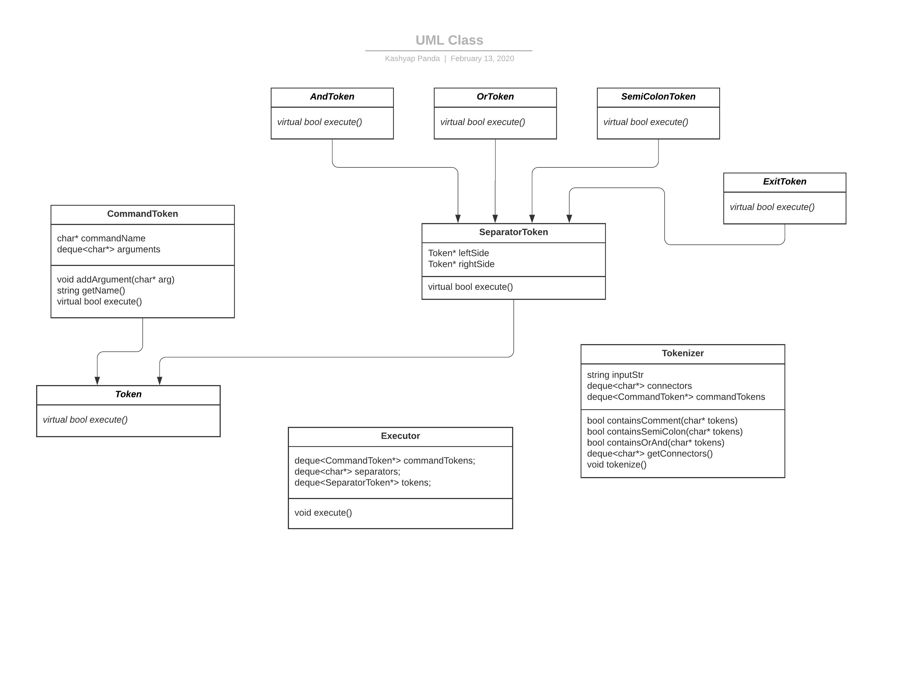

# CS 100 Programming Project

# Project Information
* Winter 2020
* Collaborators
  * Kashyap Panda (862076026)
  * Mayur Ryali (862076991)
  
<h1>Introduction</h1>

<d1>
    <dd>This is the rshell in C++ project by Mayur Ryali and Kashyap Panda where we will be creating a CLI shell. A shell is a user interface that allows for access to an operating system’s services. The program will be able to eventually prompt the user with a ‘$’, read in lines of commands that support logical connectors from standard input, and execute the commands using “fork”, “execvp”, and “waitpid”. The program will repeat the above steps until an exit command is executed. Any number of commands and combinations of said commands should be able to be chained together using the connectors. To represent the commands and operators in our program, we will be using the composite design pattern. The token class is the component, the executor class is a leaf, and the tokenizer class is the composite. </dd>    
</d1>

 

# Diagram

<h1>Classes</h1>

*Token Class*
<d1>
<dd>This is an abstract parent class for different types of token or a single element of a programming language. This can include  keywords, 
identifiers, operators, separators, literals, or even punctuation. Some of the defined functions will be connector functions (AND, OR, etc.) 
and functions to store the commands and arguments. 
This class will have a subclass that will implement deques that contain the left and right commands in a chained together command input. 
This will allow for easier access and execution of the chained commands. 
Another subclass is the command token class which will take deques that will store the arguments a given command can take. </dd>
</d1>

 

*Executor Class*
<d1>
<dd> Calls execute function and refines the tokenized commands. </dd>
</d1>

 

*Tokenizer Class*
<d1>
<dd>Parser class that will parse user input and create the commands and connectors.</dd>
</d1>

 

*SeparatorToken Class*
<d1>
<dd> Token sublass that assigns the left and right tokens on either side of a connector. </dd>
</d1>

 

*CommandToken Class*
<d1>
<dd> Token sublcass responsible for forking and running execvp on the command. </dd>
</d1>

 

*AND/OR/SEMICOLON/EXIT Token Classes*
<d1>
<dd> These are sublasses of SeparatorToken that handle execution when the connector is '&&', '||', ';', or the exit command, respectively. </dd>
</d1>

# Prototypes/Research
The prototype functions for `waitpid()`, `execvp()`, and `fetch()` show promise. The sample program is able to comfortable execute basic commands. More work is needed to actually separate the execution onto a different system thread. The parser is able to separate different commands and their separators, but needs more work to actually create different tokens for each command. The code written will be beneficial to Assignment 2, as it lays down the foundations for the actual functionality of the shell.

# Development and Testing Roadmap
- [ ] [#1](/../../issues/1) Create Token (Including AndToken, OrToken, SemiColonToken, CommandToken)
- [ ] [#2](/../../issues/2) Create Token tests
- [ ] [#3](/../../issues/3) Create Executor
- [ ] [#4](/../../issues/4) Create Executor tests
- [ ] [#5](/../../issues/5) Create Tokenizer
- [ ] [#6](/../../issues/6) Create Tokenizer tests

